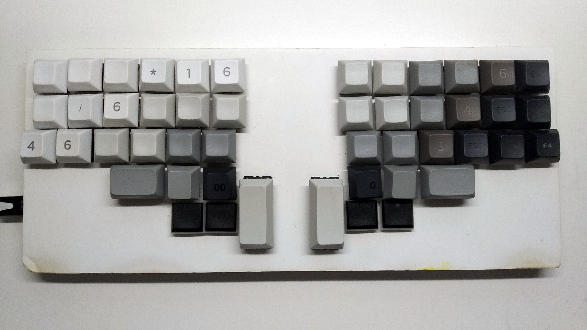
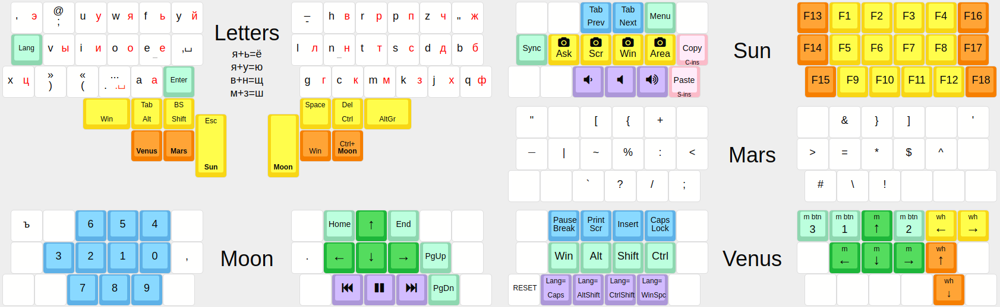

# Σάγαρις

**Sagaris** is a semichorded ergonomic keyboard. The picture above shows it after half a year of daily usage. See the [`src`](https://github.com/bouncepaw/sagaris/tree/master/src) folder for the source literate form and for further description.

Sagaris is a derivate from my previous keyboard [Sequira](https://github.com/bouncepaw/sequira).

[Typing demo on YouTube](https://www.youtube.com/watch?v=LchMhXH5n4I)

## Layout

## How to flash

Install [qara2c](https://github.com/bouncepaw/qara2c) as `~/bin/qara2c`. Modify the `Makefile` if you want to use a different location.

Adjust the `QMKDIR` variable in the `Makefile`.

Run `make flash` to tangle and flash the firmware to the keyboard. If you change the config file, you will also need to run `make reconfigure` beforehand.

If you use some specific distributions of GNU+Linux, you may want to run my [`set-kb-layout`](https://github.com/klavarog/chat/blob/master/scripts.md#set-kb-layout) script 2 seconds after flashing. I use it on Arch running LXDE.

## Implementation details

This firmware depends on modules developed by Optozorax, ergo (pun intended) a modified version of QMK is needed. See his [Moonlander firmware](https://github.com/optozorax/moonlander/) for more information.

If you don't want to use literate programming, do not. I want, ergo I do.

