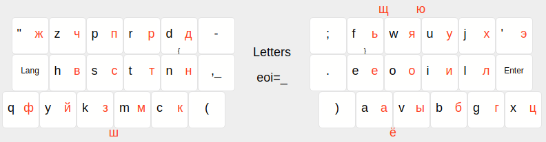
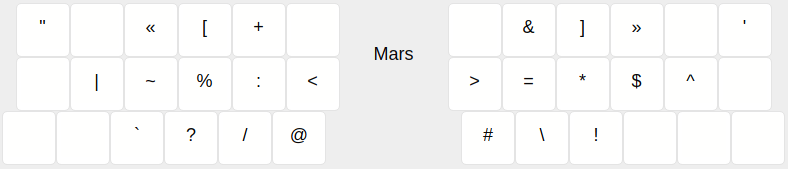
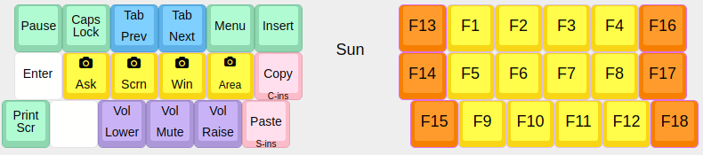
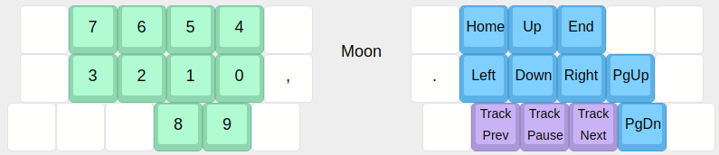

# Keymap

```
#include QMK_KEYBOARD_H
```

## The layers

```c
const uint16_t PROGMEM keymaps[][MATRIX_ROWS][MATRIX_COLS] = {
```



```c
[LATIN] = FINGERS(
    KC_DQUO, KC_Z, KC_P, KC_R, KC_D, KC_MINS,
    KK_LANG, KC_H, KC_S, KC_T, KC_N, KK_COMMA,
    KC_Q,    KC_Y, KC_K, KC_M, KC_C, KC_LPRN,
    KC_SCLN, KC_F, KC_W, KC_U, KC_J, KC_QUOT,
    KC_DOT,  KC_E, KC_O, KC_I, KC_L, KC_ENT,
    KC_RPRN, KC_A, KC_V, KC_B, KC_G, KC_X),
[CYRILLIC] = FINGERS(
    RU_ZH,   RU_CH,   RU_P,  RU_R,  RU_D, KC_MINS,
    KK_LANG, RU_V,    RU_S,  RU_T,  RU_N, KK_COMMA,
    RU_F,    RU_J,    RU_Z,  RU_M,  RU_K, KC_LPRN,
    RU_SCLN, RU_SOFT, RU_JA, RU_U,  RU_H, RU_E,
    RU_DOT,  RU_JE,   RU_O,  RU_I,  RU_L, KC_ENT,
    KC_RPRN, RU_A,    RU_Y,  RU_B,  RU_G, RU_TS),
```



```c
[MARS] = FINGERS(
    KK_DQUO, _______, KK_GUIL, KK_SQU,  KC_PLUS, _______,
    _______, KK_PIPE, KK_TILD, KC_PERC, KK_CLN,  KK_LT,
    _______, _______, KK_GRVE, KK_QUES, KK_SLSH, KK_AT,
    _______, KK_AMP,  KK_ARE,  KK_EMOT, _______, KK_QUOT,
    KK_GT,   KC_EQL,  KC_ASTR, KK_DOLL, KK_CIRC, _______,
    KK_HASH, KK_BSLS, KC_EXLM, _______, _______, _______),
```



```c
[SUN] = FINGERS(
    KC_PAUS, KC_CARS, KK_TPRV, KK_TNXT, KC_APP,  KC_INS,
    KC_ENT,  KK_SASK, KK_SSCN, KK_SWIN, KK_SSEL, KK_COPY,
    KC_PSCR, _______, KC_VOLU, KC_MUTE, KC_VOLD, KK_PSTE,
    KC_F13,  KC_F1,   KC_F2,   KC_F3,   KC_F4,   KC_F16,
    KC_F14,  KC_F5,   KC_F6,   KC_F7,   KC_F8,   KC_F17,
    KC_F15,  KC_F9,   KC_F10,  KC_F11,  KC_F12,  KC_F18),
```



```c
[MOON] = FINGERS(
    _______, KC_7,    KC_6,    KC_5,    KC_4,    _______,
    _______, KC_3,    KC_2,    KC_1,    KC_0,    KK_comma,
    _______, _______, _______, KC_8,    KC_9,    _______,
    _______, KC_HOME, KC_UP,   KC_END,  _______, _______,
    KK_DOT,  KC_LEFT, KC_DOWN, KC_RGHT, KC_PGUP, _______,
    _______, KC_MPRV, KC_MPLY, KC_MNXT, KC_PGDN, _______),
```

Mouse layer pic to be done.

```c
[MOUSE] = FINGERS(
XXXXXXX,    XXXXXXX, XXXXXXX, XXXXXXX, XXXXXXX, XXXXXXX,
XXXXXXX,    XXXXXXX, XXXXXXX, XXXXXXX, XXXXXXX, XXXXXXX,
XXXXXXX,    XXXXXXX, XXXXXXX, XXXXXXX, XXXXXXX, XXXXXXX,
KC_MS_BTN3, KC_BTN1, KC_MS_U, KC_BTN2, KC_WH_L, KC_WH_R,
XXXXXXX,    KC_MS_L, KC_MS_D, KC_MS_R, KC_WH_U, XXXXXXX,
XXXXXXX,    XXXXXXX, XXXXXXX, XXXXXXX, KC_WH_D, XXXXXXX),
```

```c
};
```

