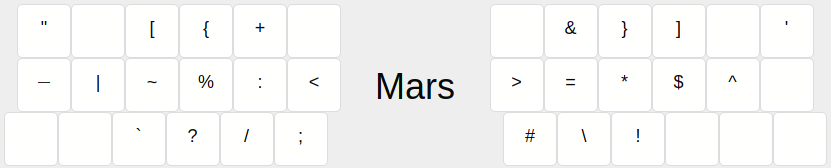
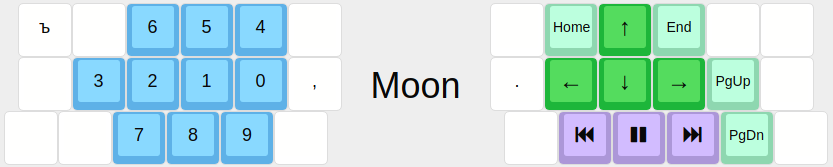

# Keymap

```c
#include QMK_KEYBOARD_H
#include "layermode.h"
#include "lang_shift/include.h"
#include "arbitrary_keycode/include.h"
#include "combo/include.h"
```

**Fun fact:** pictures are really outdated.

## Combo stuff
### defconst
- `BC_N CMB_000`
- `BC_S_N CMB_001`
- `BC_T CMB_002`
- `BC_S_T CMB_003`
- `BC_S CMB_004`
- `BC_S_S CMB_005`
- `BC_JA CMB_006`
- `BC_S_JA CMB_007`
- `BC_SF CMB_008`
- `BC_S_SF CMB_009`
- `BC_Z CMB_010`
- `BC_S_Z CMB_011`
- `BC_M CMB_012`
- `BC_S_M CMB_013`
- `BC_V CMB_014`
- `BC_S_V CMB_015`
- `BC_U CMB_016`
- `BC_S_U CMB_017`

```c
#define EN_LETTER(l) CHORD(EN_##l, AC_##l)
#define RU_LETTER(l) CHORD(RU_##l, BC_##l), CHORD(RU_S_##l, BC_S_##l)
#define DUOLETTER(l, a, b) CHORD(RU_##l, BC_##a, BC_##b), CHORD(RU_S_##l, BC_S_##a, BC_S_##b)
const ComboWithKeycode combos[] = {
  // Letter declarations
  //EN_LETTER(F), EN_LETTER(E), EN_LETTER(H), EN_LETTER(N),
  RU_LETTER(N), RU_LETTER(JA), RU_LETTER(SF), 
  RU_LETTER(Z), RU_LETTER(M), RU_LETTER(V), RU_LETTER(U), 

  //CHORD(EN_LCBR, AC_F, AC_E), CHORD(EN_RCBR, AC_H, AC_N), // { } EN
  //        l ← a + b
  DUOLETTER(JO, JA, SF), // ё
  DUOLETTER(JU, U,  JA), // ю
  DUOLETTER(SH, Z,  M),  // ш
  DUOLETTER(SC, V,  N),  // щ
};
const uint8_t combos_size = sizeof(combos)/sizeof(ComboWithKeycode);
```

## The layers

```c
const uint16_t PROGMEM keymaps[][MATRIX_ROWS][MATRIX_COLS] = {
```


The Cyrillic chords are not declared in this file, see `chords.ini`.

```c
[LATIN] = FINGERS(
    KC_QUOT,  EN_SCLN, EN_U,    EN_W,    EN_F,      EN_Y,   
    LA_CHNG,  EN_V,    EN_I,    EN_O,    EN_E,      AG_CMSP,
    EN_X,     EN_RPRN, EN_LPRN, EN_DOT,  EN_A,      KC_ENT,
    EN_MINS,  EN_H,    EN_R,    EN_P,    EN_Z,      EN_DQUO,
    EN_L,     EN_N,    EN_T,    EN_S,    EN_D,      EN_B,
    EN_G,     EN_C,    EN_M,    EN_K,    EN_J,      EN_Q),
[LATIN_SHIFT] = FINGERS(
    _______,  EN_AT,   EN_S_U,  EN_S_W,  EN_S_F,    EN_S_Y, 
    LA_CHNG,  EN_S_V,  EN_S_I,  EN_S_O,  EN_S_E,    EN_COMM, 
    EN_S_X,   KK_EMOT, KK_GUIL, AG_3DOT, EN_S_A,    LSFT(KC_ENT), 
    EN_UNDS,  EN_S_H,  EN_S_R,  EN_S_P,  EN_S_Z,    _______, 
    EN_S_L,   EN_S_N,  EN_S_T,  EN_S_S,  EN_S_D,    EN_S_B,
    EN_S_G,   EN_S_C,  EN_S_M,  EN_S_K,  EN_S_J,    EN_S_Q),
[CYRILLIC] = FINGERS(
    RU_E,     RU_SCLN, BC_U,    BC_JA,   BC_SF,     RU_J,   
    LA_CHNG,  RU_Y,    RU_I,    RU_O,    RU_JE,     AG_CMSP,
    RU_TS,    KC_RPRN, KC_LPRN, KK_DTSP, RU_A,      KC_ENT,
    RU_MINS,  BC_V,    RU_R,    RU_P,    RU_CH,     RU_ZH,
    RU_L,     BC_N,    RU_T,    RU_S,    RU_D,      RU_B,
    RU_G,     RU_K,    BC_M,    BC_Z,    RU_H,      RU_F),
[CYRILLIC_SHIFT] = FINGERS(
    RU_S_E,   EN_AT,   BC_S_U,  BC_S_JA, BC_S_SF,   RU_S_J, 
    LA_CHNG,  RU_S_Y,  RU_S_I,  RU_S_O,  RU_S_JE,   AG_CMSP, 
    RU_S_TS,  KK_EMOT, KK_GUIL, AG_3DOT, RU_S_A,    LSFT(KC_ENT), 
    RU_MINS,  BC_S_V,  RU_S_R,  RU_S_P,  RU_S_CH,   RU_S_ZH, 
    RU_S_L,   BC_S_N,  RU_S_T,  RU_S_S,  RU_S_D,    RU_S_B,
    RU_S_G,   RU_S_K,  BC_S_M,  BC_S_Z,  RU_S_H,    RU_S_F),
```



```c
[MARS] = FINGERS(
    AG_DQUO, _______, EN_LBRC, EN_LCBR, AG_PLUS, _______,
    KK_MDSH, EN_PIPE, EN_TILD, AG_PERC, AG_COLN, EN_LT,
    _______, _______, EN_GRV,  AG_QUES, AG_SLSH, AG_SCLN,
    _______, EN_AMPR, EN_RCBR, EN_RBRC, _______, EN_QUOT,
    EN_GT,   AG_EQL,  KC_ASTR, EN_DLR,  EN_CIRC, _______,
    EN_HASH, AG_BSLS, KC_EXLM, _______, _______, _______),
```


```c
[SUN] = FINGERS(
    _______, _______, KK_TPRV, KK_TNXT, KC_APP,  _______,
    LA_SYNC, KK_SASK, KK_SSCN, KK_SWIN, KK_SSEL, KK_COPY,
    _______, _______, KC_VOLD, KC_MUTE, KC_VOLU, KK_PAST,
    KC_F13,  KC_F1,   KC_F2,   KC_F3,   KC_F4,   KC_F16,
    KC_F14,  KC_F5,   KC_F6,   KC_F7,   KC_F8,   KC_F17,
    KC_F15,  KC_F9,   KC_F10,  KC_F11,  KC_F12,  KC_F18),
```



```c
[MOON] = FINGERS(
    RU_HD,   _______, KC_6,    KC_5,    KC_4,    _______,
    _______, KC_3,    KC_2,    KC_1,    KC_0,    AG_COMM,
    _______, _______, KC_7,    KC_8,    KC_9,    _______,
    _______, KC_HOME, KC_UP,   KC_END,  _______, _______,
    AG_DOT,  KC_LEFT, KC_DOWN, KC_RGHT, KC_PGUP, _______,
    _______, KC_MPRV, KC_MPLY, KC_MNXT, KC_PGDN, _______),
```


```c
[VENUS] = FINGERS(
    XXXXXXX,    KC_PAUS, KC_PSCR, KC_INS,  KC_CAPS, XXXXXXX,
    XXXXXXX,    KC_LGUI, KC_LALT, KC_RSFT, KC_LCTL, XXXXXXX,
    RESET,      LA_CAPS, LA_ALSH, LA_CTSH, LA_WISP, XXXXXXX,
    KC_MS_BTN3, KC_BTN1, KC_MS_U, KC_BTN2, KC_WH_L, KC_WH_R,
    XXXXXXX,    KC_MS_L, KC_MS_D, KC_MS_R, KC_WH_U, XXXXXXX,
    XXXXXXX,    XXXXXXX, XXXXXXX, XXXXXXX, KC_WH_D, XXXXXXX),
```

```c
};
```

## Record processing

```c
void user_timer(void) {
  combo_user_timer();
  lang_shift_user_timer();
}

void matrix_scan_user(void) {
  user_timer();
}

bool process_record_user(uint16_t keycode, keyrecord_t *record) {
  if (combo_enabled && !combo_process_record(keycode, record))
    return false;
  if (!lang_shift_process_record(keycode, record))
    return false;
  KEYTIMER(M_LGUI);
  KEYTIMER(M_LALT_TAB);
  KEYTIMER(M_SUN_ESC);
  KEYTIMER(M_RGUI);
  KEYTIMER(M_RCTL_DEL);
  KEYTIMER(M_RCTL_MOON);
  KEYTIMER(M_CRINGESHIFT);
  switch (keycode) {
    /*       key         turn off       turn on   hold     tap */
    KEYMATCH(M_LGUI,      _BV(CYRILLIC), 0,         KC_LGUI, 0);
    KEYMATCH(M_LALT_TAB,  _BV(CYRILLIC), 0,         KC_LALT, KC_TAB);
    KEYMATCH(M_SUN_ESC,   0,             _BV(SUN),  0,       KC_ESC);
    KEYMATCH(M_RGUI,      _BV(CYRILLIC), 0,         KC_RGUI, 0);
    KEYMATCH(M_RCTL_DEL,  _BV(CYRILLIC), 0,         KC_RCTL, KC_DEL);
    KEYMATCH(M_RCTL_MOON, _BV(CYRILLIC), _BV(MOON), KC_RCTL, 0);

    case M_CRINGESHIFT:
    if (record->event.pressed) {
      press_arbitrary_keycode(SHF_N, true);
      timer_M_CRINGESHIFT = timer_read();
    } else {
      press_arbitrary_keycode(SHF_N, false);
      if (timer_elapsed(timer_M_CRINGESHIFT) < TAPPING_TERM) {
        press_arbitrary_keycode(KC_BSPC, true);
        press_arbitrary_keycode(KC_BSPC, false);
      }
    }
    return false;

    case KK_DTSP:
    if (record->event.pressed) {
      press_arbitrary_keycode(AG_DOT, true);
      press_arbitrary_keycode(AG_DOT, false);
      tap_code16(KC_SPC);
    }
    return false;

    case KK_GUIL:
    if (record->event.pressed) {
      lang_activate(0);
      tap_code16(KC_SLCK);
      tap_code16(KC_LT);
      tap_code16(KC_LT);
    }
    return false;

    case KK_EMOT:
    if (record->event.pressed) {
      lang_activate(0);
      tap_code16(KC_SLCK);
      tap_code16(KC_GT);
      tap_code16(KC_GT);
    }
    return false;

    case KK_MDSH:
    if (record->event.pressed) {
      tap_code16(KC_SLCK);
      tap_code16(KC_MINS);
      tap_code16(KC_MINS);
    }
    return false;

  }
  return true;
}
```
